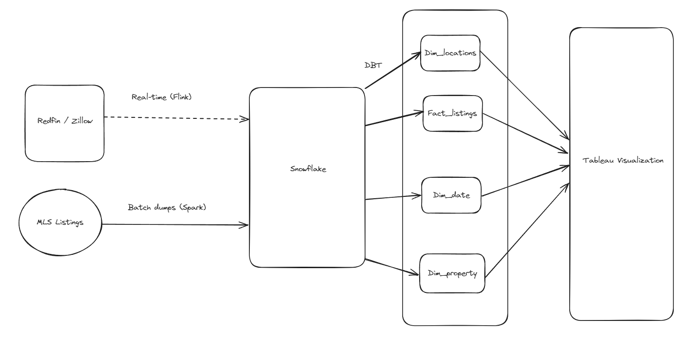

# Real Estate Trends in the County of Santa Clara

## Problem Statement
This capstone project aims at analyzing the current and historical trends of housing market in the county of Santa Clara. The purpose is to capture all the parameters related to housing market and allow the audience to visualize and get the information from multiple dimensions.

## Use cases
Some of the use cases to start of with -

1. House prices in zip codes with school rating of 7+.
2. Avg cost of houses in zip codes with good public transport connectivity.
3. Avg housing price increase / decrease for a condo / townhome / single-family home for a given zip code during the last 5 years.
4. Avg time on market for a given zip code during the past x years.
5. Avg monthly payments

## Tech Stack
Snowflake, DBT, Flink, Spark, Tableau and Airflow

## Data Sources
1. Scrap realtime data from Redfin/Zillow using Apache Flink
2. Extract data from mlslistings.com
3. ?

## Model

## Future additions
1. Add use-cases about the rental property.
2. Add use cases about the avg spendings on home renovation.
3. School Ratings
4. Population + spending data around the given zip code.
5. Extend across all counties of California, West Coast and finally across US.